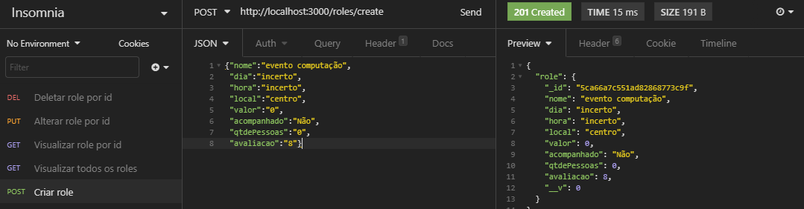
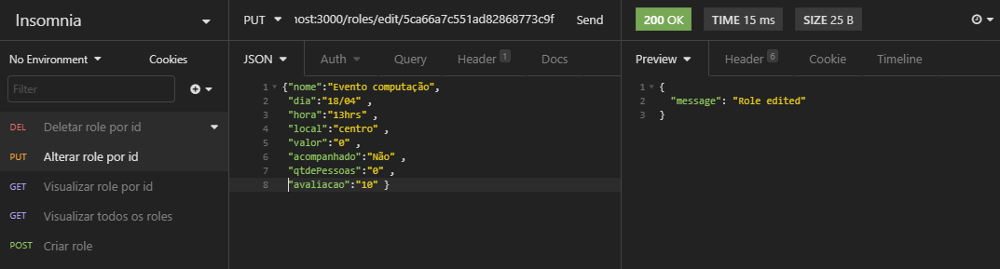
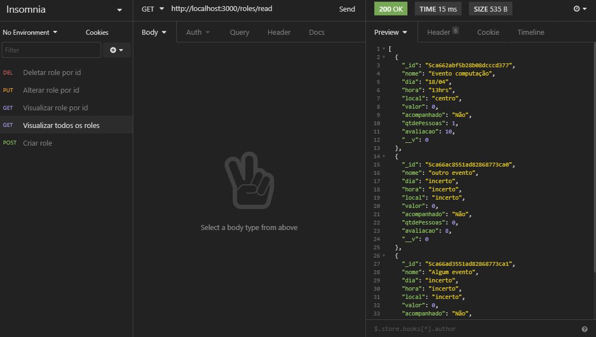

# API para desafio-back

## Endpoints:

### Para criar um role:
* URL: api/roles/create
* Metodo: POST
* Status Codes:
201- Criado //
400- Algum atributo está faltando //
500- Problema interno no servidor

### Para visualizar todos os roles:
* URL: api/roles/read
* Metodo: GET
* Status Codes:
200- Tudo ok //
204- Lista vazia //
500- Erro interno no sevidor

### Para visualizar um role especifico:
* api/roles/read/:Id
* Metodo: GET
* Status Codes:
200- Tudo ok //
404- Role não encontrado //
500- Problema interno no servidor

### Para alterar algum role:
* URL: api/roles/edit/:Id
* Metodo: PUT
* Status Codes: 
200- Tudo ok //
400- Algum atributo está faltando //
500- Problema interno no servidor

### Para deleter algum role:
* URL:api/roles/delete:id
* Metodo: DELETE
* Status Codes:
200-Tudo ok //
404- Role não encontrado //
500- Problema interno no servidor

## Instruções:
|Requisição|Pedido|
|---------|---------|
|Nome       |texto|
|dia        |texto|
|hora       |texto|
|local      |texto|
|valor      |numero|
|acompanhado|texto|
|qtdePessoas|numero|
|avaliacao  |numero|

## Localização dos arquivos com configuração de credenciais para o banco de dados ou chave de variável ambiente:
config/database.config.js

## Todas as funcionalidades da API:

* Criar um role.
* Editar um role.
* Visualizar todos os roles ou um especifico.
* Deletar um role.

## Imagens do funcionamento:

* criando um role:

* editando um role:

* visualizando todos os roles:

